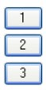
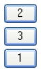
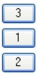

# Тестовое задание в RPT Company

## [Задача №4](/4)

Cоздать 3 кнопки с названиями `1`, `2`, `3`, расположенные друг над другом.

Начальный вид:

Нажали на любую кнопку, меняется порядок на:

Нажали на любую кнопку, меняется порядок на:

Нажали на любую кнопку, меняется порядок на:

Код должен быть написан с использованием библиотеки jQuery.
